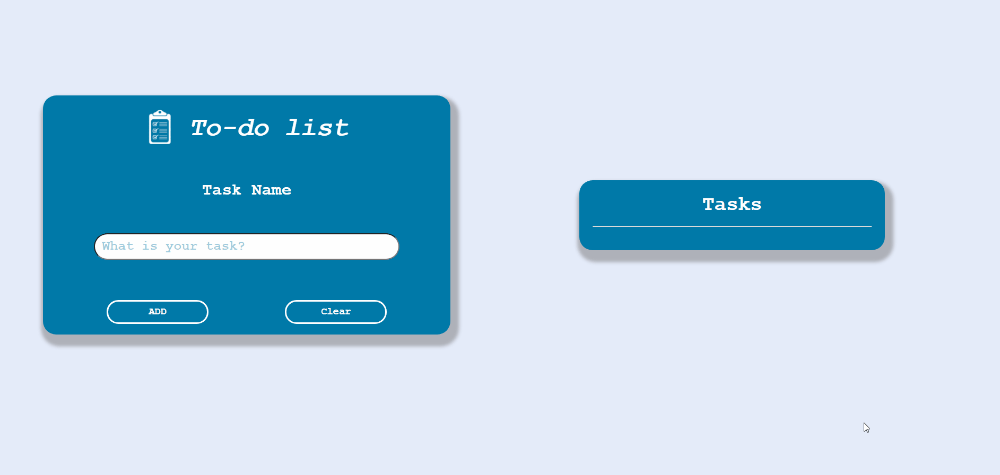

# **Projeto to-do list**
### Este projeto / desafio se trata de uma lista de tarefas criada com a finalidade de praticar conceitos de manipulação da DOM.
 
## :hammer: Techs:
  * HTML
  * CSS
  * JavaScript
  * VScode

## :rocket: Conhecimentos adquiridos:
* Fortalecer conceitos de manipulação da DOM.
* Usar Onclick para chamar as funções.
* Organização de projeto separando as pastas src e assets.

## :art: Projeto / Desafio:
 

  

 

Feito de ♥ por Igor Irineu
